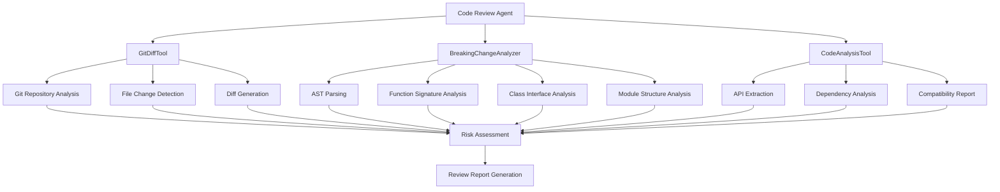

# Code Review Agent
Forked from https://github.com/bytedance/trae-agent
基于 Trae Agent 架构开发构建的专业代码评审工具，专注于检测 Python 代码库中的破坏性更改(Breaking Changes)并提供智能化的代码评审建议。

## 破坏性更改(Breaking Change)

### 定义
破坏性更改是指对代码进行的修改会导致依赖该代码的其他部分无法正常工作，需要调用方修改其代码才能继续使用。这类更改通常会破坏向后兼容性，可能导致编译错误、运行时异常或行为不一致。

### 常见类型

#### 🚨 高风险破坏性更改
- **函数签名变更**
  - 删除或重命名必需参数
  - 更改参数类型且无自动转换
  - 更改参数顺序
  - 移除函数或方法
  
- **类接口变更**
  - 删除公共方法或属性
  - 更改方法签名
  - 修改类继承关系
  - 更改构造函数参数

- **模块结构变更**
  - 重命名或移动模块
  - 删除公共API
  - 更改导入路径

#### ⚠️ 中风险破坏性更改
- **行为变更**
  - 更改函数返回值类型或结构
  - 修改异常抛出行为
  - 改变副作用(如文件操作、网络请求)
  - 性能特性显著变化

- **语义变更**
  - 相同输入产生不同输出
  - 状态变更逻辑修改
  - 默认值更改

#### ℹ️ 低风险变更
- **实现优化**
  - 内部算法改进
  - 性能优化(不改变接口)
  - 代码重构(保持接口不变)
  - 文档和注释更新

### 影响评估
- **编译时影响**: 导致调用代码无法编译通过
- **运行时影响**: 程序运行时出现异常或错误行为
- **业务逻辑影响**: 程序逻辑结果发生变化
- **性能影响**: 执行效率或资源消耗显著变化

## 🏗️ Code Review Agent 设计思路与架构

### 核心设计理念

#### 1. 独立存在
Code Review Agent 专门负责代码评审任务，与原项目的 Trae Agent 相互独立，形成功能互补：
- **Trae Agent**: 通用软件工程任务处理
- **Code Review Agent**: 专业代码评审和破坏性更改检测

#### 2. 模块化工具链
采用"分而治之"的策略，将复杂的代码评审任务分解为多个专业工具：
- **GitDiffTool**: Git仓库差异分析
- **BreakingChangeAnalyzer**: 破坏性更改检测引擎  
- **CodeAnalysisTool**: 代码结构分析器

#### 3. 智能分析流程
结合AST解析、语义分析和规则匹配，提供准确的破坏性更改检测：
- 静态代码分析确保准确性
- 语义分析理解代码意图
- 规则引擎提供可扩展的检测能力

### 核心功能

#### 破坏性更改检测
- **函数签名变更**: 检测参数添加/删除、类型变更、默认值修改
- **类接口变更**: 检测公共方法删除、属性移除、继承关系变化
- **模块结构变更**: 检测导入路径变更、模块重命名、结构重组
- **异常处理变更**: 检测新增异常类型、异常行为变更
- **返回值变更**: 检测返回类型修改、数据结构变化

#### 智能风险评估
- **高风险 (HIGH)**: API删除、参数移除、不兼容签名变更
- **中风险 (MEDIUM)**: 行为变更、新增异常、可选参数变更
- **低风险 (LOW)**: 内部实现变更、性能优化、文档更新

#### 专业建议系统
- 针对每种变更类型提供具体的改进建议
- 提供兼容性迁移指南
- 评估对下游用户的影响程度

### 详细架构设计


### 文件结构

```
trae_agent/
├── tools/
│   ├── git_diff_tool.py              # Git差异分析工具
│   ├── breaking_change_analyzer.py   # 破坏性更改分析器
│   ├── code_analysis_tool.py         # 代码结构分析工具
│   └── __init__.py                   # 更新的工具注册表
├── agent/
│   ├── code_review_agent.py          # 代码评审专用Agent
│   └── agent.py                      # 更新的Agent系统
├── prompt/
│   └── code_review_prompt.py         # 代码评审提示词模板
└── cli.py                            # 更新的CLI接口

tests/
├── tools/
│   ├── test_git_diff_tool.py         # Git工具测试
│   ├── test_breaking_change_analyzer.py  # 分析器测试
│   └── test_code_analysis_tool.py    # 代码分析测试
└── test_code_review_integration.py   # 集成测试
```

### 关键组件详解

#### 1. GitDiffTool - Git差异分析工具
**功能**: 分析Git仓库中的代码变更
**核心能力**:
- 多种分析模式：未暂存变更、文件变更、行级差异
- 智能文件过滤：支持glob模式文件选择
- 变更上下文：提供完整的变更上下文信息

**技术实现**:
```python
class GitDiffTool(BaseTool):
    def __init__(self):
        super().__init__(
            name="git_diff_tool",
            description="分析Git仓库中的代码变更和差异"
        )
```

#### 2. BreakingChangeAnalyzer - 破坏性更改分析器
**功能**: 核心的破坏性更改检测引擎
**核心能力**:
- AST级别的代码分析
- 多维度变更检测：函数、类、模块
- 智能风险评估：HIGH/MEDIUM/LOW分级
- 影响范围分析

**技术实现**:
```python
class BreakingChangeAnalyzer(BaseTool):
    def __init__(self):
        super().__init__(
            name="breaking_change_analyzer",
            description="检测和分析代码中的破坏性更改"
        )
```

**检测算法**:
- **函数签名比较**: 参数名称、类型、默认值、顺序对比
- **类接口分析**: 方法列表、属性访问、继承关系检查
- **模块结构检测**: 导入路径、公共API、命名空间变化

#### 3. CodeAnalysisTool - 代码结构分析工具
**功能**: 提供代码结构分析和兼容性评估
**核心能力**:
- API自动提取：识别公共接口
- 依赖关系分析：内部和外部依赖映射
- 兼容性报告：生成详细的兼容性评估
- 代码质量分析：结构复杂度、耦合度评估

#### 4. CodeReviewAgent - 专业评审代理
**功能**: 协调各个工具，执行完整的代码评审流程
**特点**:
- 继承自BaseAgent，与TraeAgent平行
- 专用工具链集成
- 智能任务分解
- 专业提示词优化

**架构位置**:
```
BaseAgent
├── TraeAgent (通用任务)
└── CodeReviewAgent (代码评审专用)
```

### 工作流程设计

#### 1. 任务接收与解析
- 接收用户的代码评审请求
- 解析仓库路径、分析参数
- 验证环境和权限

#### 2. 变更检测
- 使用GitDiffTool分析仓库变更
- 识别修改的文件和变更范围
- 过滤无关文件（如文档、配置等）

#### 3. 深度分析
- 使用BreakingChangeAnalyzer检测破坏性更改
- 使用CodeAnalysisTool分析代码结构
- 进行跨文件的依赖影响分析

#### 4. 风险评估
- 根据变更类型评估风险级别
- 分析对下游用户的影响范围
- 提供量化的影响评估指标

#### 5. 报告生成
- 生成结构化的评审报告
- 提供具体的改进建议
- 输出兼容性迁移指南

## 🚀 运行 Code Review Agent 的方法流程

### 环境准备

#### 1. 确保依赖安装
```bash
# 确保项目依赖已安装
cd trae-agent
uv sync --all-extras
source .venv/bin/activate
```

#### 2. 配置API密钥
```yaml
# 在配置文件 code_review_agent_config.yaml 中设置
model_providers:
    deepseek:
        api_key: your_api_key
        provider: deepseek
# 或命令行参数指定
```

### 基本使用流程

#### 1. 快速开始
```bash
# 分析当前目录的代码变更
trae-cli code-review --repo-path .

# 分析指定仓库
trae-cli code-review --repo-path /path/to/your/repository
```

#### 2. 自定义分析参数
```bash
# 设置风险阈值，只显示高风险变更
trae-cli code-review \
    --repo-path . \
    --risk-threshold high

# 指定分析范围
trae-cli code-review \
    --repo-path . \
    --analysis-scope functions \
    --output review_report.md
```

#### 3. 完整参数配置
```bash
trae-cli code-review \
    --repo-path /path/to/repo \          # 仓库路径 (必需)
    --analysis-scope all \               # 分析范围: all|functions|classes|imports  
    --risk-threshold medium \            # 风险阈值: low|medium|high
    --output report.md \                 # 输出文件路径
    --provider anthropic \               # LLM提供商
    --model claude-3-5-sonnet \          # 使用的模型
    --config-file config.yaml           # 配置文件路径
```

### 配置文件使用

#### 1. 创建配置文件
```bash
# 复制示例配置
cp code_review_config.yaml.example code_review_config.yaml
```

#### 2. 配置文件结构
```yaml
agents:
    code_review_agent:
        enable_lakeview: true
        model: code_review_model
        max_steps: 50
        tools:
            - git_diff_tool
            - breaking_change_analyzer  
            - code_analysis_tool
            - task_done

code_review:
    analysis:
        scope: "all"                    # 分析范围
        depth: "deep"                   # 分析深度
        risk_threshold: "medium"        # 风险阈值
        include_private: false          # 是否分析私有成员
    
    detection:
        function_signatures: true       # 检测函数签名变更
        class_interfaces: true          # 检测类接口变更
        module_structure: true          # 检测模块结构变更
        import_paths: true             # 检测导入路径变更
        return_values: true            # 检测返回值变更
    
    reporting:
        format: "markdown"             # 报告格式
        include_suggestions: true      # 包含改进建议
        include_impact: true           # 包含影响评估
        group_by_risk: true           # 按风险级别分组

model_providers:
    anthropic:
        api_key: ${ANTHROPIC_API_KEY}
        provider: anthropic

models:
    code_review_model:
        model_provider: anthropic
        model: claude-3-5-sonnet-20241022
        max_tokens: 8192
        temperature: 0.2
        parallel_tool_calls: true
```

#### 3. 使用配置文件
```bash
trae-cli code-review --config-file code_review_config.yaml --repo-path .
```

### 程序化使用

#### 1. 直接使用工具
```python
from trae_agent.tools.breaking_change_analyzer import BreakingChangeAnalyzer

# 创建分析器实例
analyzer = BreakingChangeAnalyzer()

# 执行分析
result = await analyzer.execute({
    "analysis_mode": "file_comparison",
    "old_code": old_version_code,
    "new_code": new_version_code,
    "file_path": "api.py",
    "check_types": ["function_signature", "class_interface"]
})

print(result)
```

#### 2. 使用Agent
```python
from trae_agent.agent.code_review_agent import CodeReviewAgent
from trae_agent.utils.config import load_config

# 加载配置
config = load_config("code_review_config.yaml")

# 创建Agent实例
agent = CodeReviewAgent(config.agents.code_review_agent)

# 执行代码评审任务
await agent.execute_task()
```

### 输出结果说明

#### 1. 控制台输出
运行过程中会显示：
- 分析进度和当前步骤
- 发现的变更文件列表
- 实时的风险评估结果
- 关键发现的摘要

#### 2. 报告文件格式
生成的Markdown报告包含：
- **概要信息**: 分析时间、文件数量、风险统计
- **破坏性更改详情**: 按风险级别分类的详细分析
- **改进建议**: 针对每个问题的具体建议
- **兼容性迁移指南**: 代码升级指导

##### 标准报告结构
```markdown
# Code Review Report

## 概要信息
- 分析时间: 2025-01-10 10:30:00
- 变更文件数: 5
- 检测到的破坏性更改: 3
- 总体风险评级: HIGH

## 破坏性更改详情

### 🚨 高风险变更
- **api.py:45** - 函数 `process_data` 移除了必需参数 `encoding`
  - **影响**: 将导致所有调用此函数的代码报错
  - **建议**: 考虑将参数设为可选，提供默认值以保持向后兼容

### ⚠️ 中风险变更  
- **models.py:120** - 类 `User` 的 `get_profile` 方法返回类型从 `dict` 变更为 `Profile`
  - **影响**: 可能影响依赖返回数据结构的代码
  - **建议**: 提供数据迁移指南，考虑渐进式迁移

### ℹ️ 低风险变更
- **utils.py:67** - 函数 `format_date` 内部实现优化
  - **影响**: 性能提升，不影响外部接口
  - **建议**: 无需特殊处理

## 改进建议
1. 对于移除的 `process_data` 参数，建议添加默认值实现向后兼容
2. 为 `User.get_profile` 方法变更提供迁移文档
3. 考虑引入废弃警告机制，给用户足够的迁移时间

## 兼容性迁移指南
### process_data 函数迁移
```python
# 旧版本调用
result = process_data(data, "utf-8")

# 新版本调用 (如果添加默认值)
result = process_data(data)  # 使用默认编码
# 或明确指定
result = process_data(data, encoding="utf-8")
```
```

#### 3. 示例报告片段
```markdown
# Code Review Report

## 概要信息
- 分析时间: 2025-01-10 10:30:00
- 变更文件数: 5
- 检测到的破坏性更改: 3
- 总体风险评级: HIGH

## 🚨 高风险变更
- **api.py:45** - 函数 `process_data` 移除了必需参数 `encoding`
  - **影响**: 将导致所有调用此函数的代码报错
  - **建议**: 考虑将参数设为可选，提供默认值以保持向后兼容
```

#### 4. 真实用例

详见[用例](./cr_agent_showcases/README.md)
```bash
# 复现命令
trae-cli code_review --repo-path /path/to/your/repo --config-file code_review_agent_config.yaml --max-steps 50 > traj.txt
```

### 故障排除

#### 常见问题及解决方案

1. **权限错误**
```bash
# 确保对仓库有读取权限
chmod +r /path/to/repository
```

2. **依赖缺失**
```bash
# 重新安装依赖
uv sync --all-extras
```

3. **API密钥问题**
```bash
# 验证API密钥设置
echo $ANTHROPIC_API_KEY
trae-cli show-config
```

4. **大型仓库分析缓慢**
```bash
# 使用文件过滤减少分析范围
trae-cli code-review --repo-path . --file-pattern "*.py"
```

### 性能优化建议

1. **分析范围优化**
   - 对于大型项目，先使用`functions`范围进行快速扫描
   - 关键模块使用`all`范围进行详细分析

2. **增量分析**
   - 针对特定文件或目录进行分析
   - 使用Git hooks在提交前自动检查
